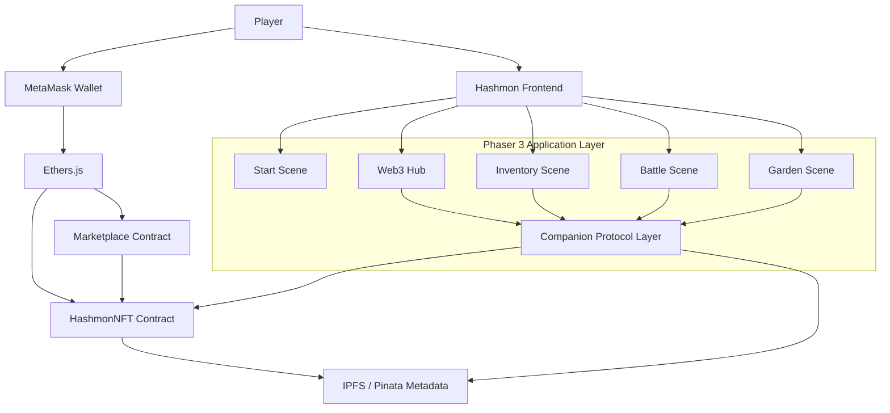
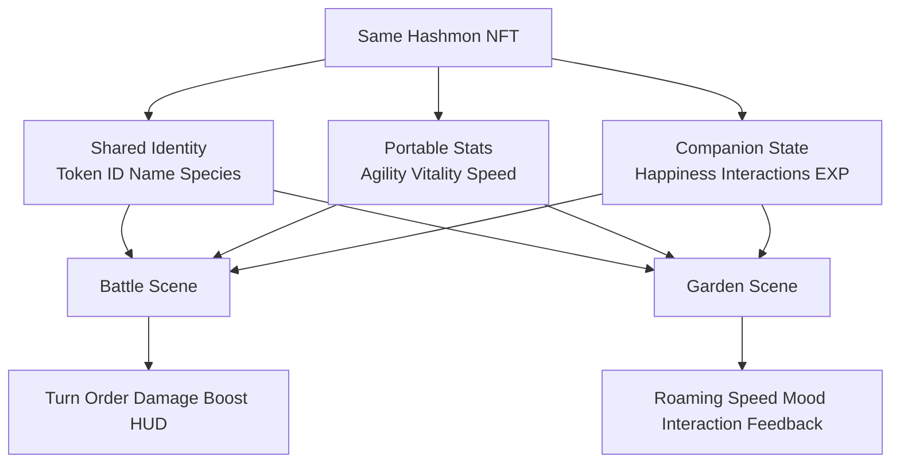

# Hashmon: A User-Generated, Cross-Game Digital Companion Ecosystem

**Course:** FTE4312 Course Project  
**Author:** Fang Baohua, 123090108  
**Listed Group Member:** Bai Qijia, 122090001  
**Date:** April 2026

---

## Abstract

This report presents **Hashmon**, a Web3 game prototype that explores how a user-generated digital companion can be minted as a non-fungible token and reused across multiple game environments. The project was motivated by two sources. First, it drew technical inspiration from **Web3DP**, a Web3-based platform for decentralized digital asset publication and management. Second, it was shaped by a personal design vision: the desire to carry a long-term monster companion into new adventures instead of losing it when a game ends or a platform changes. 

To investigate this idea in a grounded way, the project implements a browser-based prototype using **Phaser 3**, **Solidity**, **Ethers.js**, **OpenZeppelin Contracts**, and **IPFS**. Users can connect a MetaMask wallet, create a customized Hashmon, upload artwork and metadata to IPFS, mint the companion as an ERC-721 NFT on Sepolia, and view or trade the asset through an integrated marketplace flow. Most importantly, the same NFT-backed Hashmon can be interpreted across two controlled game environments: a turn-based battle scene and a garden scene. 

The project does not claim to solve global cross-game portability for the entire game industry. Instead, it offers a practical proof-of-concept for **controlled interoperability**, where the same asset identity, metadata, and portable attributes are recognized and reused across different gameplay contexts. The result is a complete end-to-end Web3 prototype that demonstrates digital ownership, decentralized metadata storage, and a realistic path toward interoperable game companions.

**Keywords:** Web3 game, NFT, ERC-721, IPFS, Phaser 3, interoperability, digital companion

---

## 1. Introduction

Digital companions occupy a special place in game design. In monster-collection and pet-raising games, players often invest significant time and emotion into the growth of a character. However, in traditional centralized systems, that companion remains locked inside one application and one publisher-controlled database. If the game shuts down, the data format changes, or the user moves to a different title, the companion usually cannot follow. This makes digital ownership fragile and limits long-term attachment.

Hashmon was designed as a response to this problem. The core idea is simple: a companion should not be merely a row in a private database, but a **persistent digital asset** with clear ownership and portable identity. If such an asset is represented on-chain and described by standardized metadata, then different games can, at least in principle, read and interpret that same asset in their own ways.

The original proposal envisioned a broader ecosystem of user-generated, cross-game digital companions, influenced by the architectural ideas behind Web3DP and by the author’s wish to continue adventuring with a long-time companion across future games. During development, this large vision was intentionally narrowed into a more rigorous and demonstrable course-project goal: **to prove, in two controlled environments, that the same NFT companion can retain its identity and meaningful attributes across different gameplay systems**.

This reframing was important. As pointed out in the project feedback, interoperability is not simply a matter of rendering the same file in different interfaces. Real interoperability requires some agreement on portable identity, attribute semantics, and state interpretation. Therefore, Hashmon focuses on a practical and academically defensible definition of interoperability: the same NFT companion can be recognized across two game scenes and can expose a shared set of portable fields, while each scene interprets those fields differently according to its own gameplay logic.

The major contributions of this project are as follows:

1. It implements an end-to-end Web3 game prototype with wallet connection, NFT minting, IPFS metadata storage, and marketplace interaction.
2. It defines a lightweight **Companion Protocol** layer for portable NFT companion data.
3. It demonstrates the same asset in two controlled environments: a **Battle Scene** and a **Garden Scene**.
4. It provides a concrete, working response to the question of what “cross-game interoperability” can realistically mean in a course-scale project.

---

## 2. Related Work and Background

### 2.1 Web3DP as Project Inspiration

A major inspiration for Hashmon was **Web3DP**, a crowdsourcing platform for 3D models built on Web3 infrastructure [1]. Web3DP showed that decentralized asset hosting and blockchain-based registration can be combined into a user-facing application. Although Hashmon ultimately used a 2D pixel-art implementation rather than a full 3D pipeline, Web3DP influenced the project’s overall direction in three ways: decentralized asset storage, on-chain ownership representation, and Web-based access to user-created assets.

### 2.2 ERC-721 and NFT Ownership

The project uses the ERC-721 standard as the foundation for ownership and transfer logic [2]. ERC-721 is a widely adopted standard for non-fungible tokens and provides a clear interface for minting, querying ownership, enumerating assets, and reading token metadata. In the context of Hashmon, the NFT serves as the persistent identity layer of a digital companion.

### 2.3 IPFS for Decentralized Metadata

To avoid centralizing all asset data in a conventional server database, Hashmon stores NFT metadata and uploaded images on IPFS. IPFS uses content-addressed storage and peer-to-peer retrieval, making it well suited to persistent digital assets [3]. In this project, Pinata was used as a practical pinning service to keep metadata and images accessible through a gateway.

### 2.4 Token-Bound Accounts as a Future Direction

The idea of an NFT that can accumulate its own game state aligns with the motivation of ERC-6551, which proposes token-bound accounts for NFTs [4]. A fully on-chain ERC-6551 implementation was beyond the final scope of this course submission, but the design of Hashmon’s protocol layer and the Garden-to-Battle state carryover was explicitly informed by this concept.

### 2.5 Development Tooling

The implementation also relied on modern Ethereum development tools such as Ethers.js for client-side blockchain interaction [5] and OpenZeppelin Contracts for secure, standardized smart contract components [6]. These tools reduced implementation risk and helped ensure compatibility with common ERC-721 workflows.

---

## 3. Problem Statement and Design Goals

The project addresses three related problems.

### 3.1 Centralized Data Silos

Traditional games typically store all character data in private databases. This prevents assets from moving across different experiences and makes them dependent on platform operators.

### 3.2 Weak User Ownership

Even when players invest time and emotion into a companion, they usually do not have independent ownership of that asset. Access is conditional on the game’s servers and business model.

### 3.3 Ambiguity in Cross-Game Interoperability

The strongest critique of many Web3 gaming visions is that “cross-game compatibility” often remains vague. If one game values speed as turn order, while another values speed as movement behavior, the same attribute cannot simply be copied without interpretation. Therefore, the project goal was not to claim universal interoperability, but to make interoperability concrete and testable.

Based on these problems, the design goals of Hashmon were defined as follows:

- allow a user to create and own a companion as an NFT;
- store the companion’s metadata in a decentralized manner;
- let the same NFT be recognized across multiple scenes;
- define portable attributes that can be interpreted differently but consistently;
- provide a complete and demonstrable DApp flow suitable for an academic project.

---

## 4. System Architecture

Hashmon follows a three-layer architecture.

**Figure 1.** Overall system architecture of Hashmon.

### 4.1 Application Layer

The game frontend is built with **Phaser 3** and vanilla JavaScript modules. The main scenes are:

- **Start Scene**: main menu and navigation entry;
- **Web3 Scene**: wallet connection, NFT browsing, create-and-mint flow, and marketplace access;
- **Inventory Scene**: detailed inspection of owned Hashmon;
- **Battle Scene**: turn-based combat;
- **Garden Scene**: a casual environment in which Hashmon roam and interact.

The start scene and web3 hub are shown below.

### 4.2 Blockchain Layer

The blockchain layer consists of two Solidity contracts:

- **HashmonNFT**, which handles minting and token metadata references;
- **HashmonMarketplace**, which handles listing and purchasing NFT companions.

These contracts were deployed on the **Sepolia** test network. The project used Hardhat and OpenZeppelin-compatible contracts to accelerate deployment and testing.

### 4.3 Storage Layer

The metadata JSON and optional uploaded companion image are stored on **IPFS** through Pinata. The token contract stores the metadata URI, while the frontend resolves that URI and hydrates the in-game representation.

### 4.4 Companion Protocol Layer

To address the professor’s feedback on interoperability, the project added a lightweight application-level **Companion Protocol**. This protocol standardizes the following fields for each NFT companion:

- identity information such as token ID, nickname, species, type, and level;
- battle-relevant numeric stats;
- portable normalized stats such as agility and vitality;
- game adapter values for each scene;
- interaction state such as garden interactions, happiness, and battle count.

This layer acts as a bridge between NFT metadata and scene-specific gameplay logic.

---

## 5. Workflow and Design Description

**Figure 2.** End-to-end user workflow from wallet connection to gameplay and trading.

### 5.1 Wallet Connection and Asset Retrieval

A player begins in the Web3 hub and connects MetaMask through Ethers.js. Once connected, the frontend queries the deployed ERC-721 contract to retrieve the player’s NFT balance and token URIs. These URIs are then resolved through the configured IPFS gateway, allowing the metadata to populate the in-game inventory.

This flow is important because it links the external blockchain identity to the game’s internal representation. The result is not merely a mock asset list, but an inventory that can be derived from on-chain ownership.

### 5.2 Create and Mint Workflow

In the Create & Mint interface, the player can customize:

- nickname,
- base species,
- custom element type,
- move set,
- artwork image,
- chain-randomized stats.

After confirmation, the frontend builds a metadata object, uploads the image and metadata to IPFS, then calls the NFT contract’s mint function. This creates a full user-generated asset pipeline inside the browser.

### 5.3 Marketplace Workflow

The marketplace supports the asset lifecycle beyond minting. A player can list a Hashmon for sale, another player can purchase it, and the frontend refreshes inventory and market state accordingly. This demonstrates that the NFT is not only a viewable collectible but also a tradable Web3 asset.

The marketplace interface is shown below.

### 5.4 Controlled Cross-Game Interoperability

The central design experiment of the project was the reuse of the same NFT companion across two environments.

- In the **Battle Scene**, the active Hashmon is interpreted as a turn-based combat unit. Its stats affect HP, damage potential, and speed.
- In the **Garden Scene**, the same Hashmon is interpreted as a roaming digital pet. Normalized agility controls movement speed, while interaction counters and happiness state track lightweight progression.

This mapping addresses the professor’s feedback directly. Instead of claiming generic compatibility across arbitrary games, the project defines a **portable subset of meaning** that can be reused across two systems.

### 5.5 State Carryover Between Scenes

Garden interactions increment companion-related state such as happiness, interaction count, and gained experience. These values are then surfaced when the same NFT is used in the battle scene, where a small gameplay boost can be shown. This is a simplified but concrete demonstration of the idea that a companion can accumulate meaningful history outside a single battle module.

**Figure 3.** Controlled cross-game interoperability mapping for the same NFT companion.

The proof panel and battle reuse are shown below.

---

## 6. Implementation Details

### 6.1 Frontend Implementation

The project is implemented in a lightweight but modular way. Each gameplay scene is separated into its own file, while shared game logic and player state live under the data and battle layers. This structure improved maintainability and made it easier to add Web3 features gradually.

A key implementation improvement was the addition of an **active companion** mechanism. Instead of each scene reading from independent static demo data, the project now allows one selected NFT to function as the currently active Hashmon. This NFT can then be reused across the inventory, garden, and battle systems.

### 6.2 Smart Contracts

The NFT contract supports minting and ownership enumeration required for fetching the player’s assets. The marketplace contract supports listing and purchase flows. During development, several compatibility issues related to newer OpenZeppelin versions had to be addressed, especially with overrides and transfer logic. These were resolved so that the contracts could compile and deploy on Sepolia.

### 6.3 Metadata and Portable Semantics

Each minted Hashmon stores structured metadata including name, species, type, moves, battle stats, normalized stats, and minting source. The project then derives scene-specific interpretations from this metadata.

For example:

- **agility** maps to movement speed in the garden;
- **speed** affects battle responsiveness;
- **happiness** and interaction history can be displayed and used as small battle modifiers.

This design turns interoperability from a vague slogan into a concrete translation process between scenes.

### 6.4 IPFS Integration

Uploaded images and metadata are pinned to IPFS. This enables the companion to remain externally addressable and not solely dependent on the frontend runtime. From a Web3 perspective, this is essential because the metadata URI becomes part of the token’s long-lived identity.

### 6.5 Engineering Challenges and Solutions

Several non-trivial engineering issues were encountered and solved during development:

- browser caching caused stale JavaScript to remain active after Web3 updates;
- Ethers.js loading had to be switched to a working CDN path;
- contract ABIs and address configuration had to be carefully synchronized;
- OpenZeppelin v5 compatibility changes required contract revisions;
- user-uploaded art needed fixed-size rendering to prevent oversized display artifacts.

These debugging steps were important because they improved the stability of the final demo and reduced presentation risk.

---

## 7. Evaluation and Results

The project was evaluated primarily as a **functional prototype**. Since the course emphasizes a practical technology-based solution, the main success criteria were end-to-end functionality, correctness of the Web3 flow, and the clarity of the interoperability demonstration.

### 7.1 Functional Results

The following features were successfully implemented and demonstrated:

| Feature | Status | Evidence |
|---|---:|---|
| Game client launches locally | Yes | Figure 1 |
| Wallet connection through MetaMask | Yes | Wallet screenshots in the FTE4312 folder |
| User-customized NFT minting | Yes | Figure 2 |
| Metadata and image upload to IPFS | Yes | Mint process screenshots |
| NFT retrieval from wallet | Yes | wallet and inventory screenshots |
| Marketplace listing and browsing | Yes | Figure 3 |
| Cross-scene active companion reuse | Yes | Figures 4 and 5 |
| Cross-game proof panel | Yes | Figure 4 |

### 7.2 Interoperability Evaluation

The strongest evaluation result is not simply that the same token can be displayed twice, but that the same token participates meaningfully in different scenes.

In the current implementation, the project demonstrates:

1. **identity persistence**: the token ID and nickname remain consistent across scenes;
2. **asset reuse**: the same owned NFT can be set as the active companion and then used in both the garden and battle modules;
3. **semantic reinterpretation**: one set of portable attributes is mapped to different gameplay meanings;
4. **state carryover**: garden-side interaction state is surfaced in the battle context.

This satisfies the project’s practical definition of interoperability within a controlled environment.

### 7.3 Why This Counts as a Successful Course Prototype

The final system does not claim seamless compatibility with arbitrary external games. That would require a broader ecosystem, shared standards, and adoption by other developers. However, the course project successfully proves that the problem can be addressed in a grounded way: a blockchain-backed companion can preserve its identity and selected state across multiple gameplay systems inside a real working DApp.

For the scope of an undergraduate technology course project, this is a meaningful and credible result.

---

## 8. Limitations and Future Work

Despite the successful prototype, the project still has several limitations.

### 8.1 Controlled Rather Than Universal Interoperability

The current implementation proves interoperability only across **two controlled scenes within one project**. This is still valuable, but it should not be confused with general cross-studio or cross-engine interoperability.

### 8.2 Partial On-Chain State

The most important companion state is currently interpreted and persisted at the application level, not fully through ERC-6551 token-bound accounts. A future version could give each Hashmon a real token-bound account and allow items, currencies, or progress to belong directly to the NFT.

### 8.3 User Interface Constraints

Some input flows still use simple browser prompts rather than a polished form system. This was acceptable for prototyping but should be improved in a production-ready version.

### 8.4 Security and Production Readiness

The system is a testnet prototype. For a production deployment, wallet security, IPFS credential handling, backend rate limiting, and more rigorous smart contract auditing would be required.

### 8.5 Expansion Possibilities

The following directions are particularly promising for future work:

- full ERC-6551 integration for token-bound state and inventory;
- richer battle and garden mechanics;
- more species, items, and progression systems;
- a better marketplace user experience;
- a decentralized content registry for user-created dungeons, modes, or skill packs;
- support for 3D formats such as glTF or VRM, closer to the original proposal vision.

---

## 9. Member Contribution Statement

The project idea refinement, frontend implementation, Web3 integration, smart contract debugging, IPFS pipeline, gameplay logic upgrades, screenshot preparation, report drafting, and presentation preparation were completed primarily by **Fang Baohua (123090108)**.

The contribution level of the other listed group member, **Bai Qijia (122090001)**, was limited during the final implementation and documentation stages. As a result, the workload distribution for this submission was significantly uneven.

---

## 10. Conclusion

Hashmon demonstrates a practical Web3 approach to digital companion ownership and reuse. Inspired by both Web3DP and the personal wish to carry a cherished companion into future adventures, the project turns that emotional and technical idea into a working course prototype.

By combining ERC-721 ownership, IPFS-based metadata, browser-based game scenes, and a lightweight companion protocol layer, the system proves that cross-game interoperability can be made concrete in a controlled environment. The same NFT is not merely displayed in multiple places; it preserves identity, carries portable state, and is meaningfully reinterpreted across distinct gameplay contexts.

Although the current prototype remains limited in scope, it provides a solid technical foundation and a credible research direction for future Web3-native game ecosystems.

---

## References

[1] Lehao Lin, “Web3DP: A Crowdsourcing Platform for 3D Models Based on Web3 Infrastructure,” GitHub repository. Available: https://github.com/LehaoLin/web3dp

[2] W. Entriken, D. Shirley, J. Evans, and N. Sachs, “ERC-721: Non-Fungible Token Standard,” Ethereum Improvement Proposals, no. 721, 2018. Available: https://eips.ethereum.org/EIPS/eip-721

[3] J. Benet, “IPFS – Content Addressed, Versioned, P2P File System,” arXiv:1407.3561, 2014. Available: https://doi.org/10.48550/arXiv.1407.3561

[4] J. Windle et al., “ERC-6551: Non-Fungible Token Bound Accounts,” Ethereum Improvement Proposals, no. 6551, 2023. Available: https://eips.ethereum.org/EIPS/eip-6551

[5] R. Moore, “ethers.js Documentation, Version 6,” 2025. Available: https://docs.ethers.org/v6/

[6] OpenZeppelin, “OpenZeppelin Contracts: A library for secure smart contract development,” 2025. Available: https://docs.openzeppelin.com/contracts/5.x/

---

## Appendix A: Reproduction Summary

To run the project locally:

1. Open the project folder.
2. Start a local static server.
3. Open the browser at the local address.
4. Connect MetaMask on Sepolia.
5. Use the Create & Mint tab to mint a custom Hashmon.
6. Inspect the companion in Inventory, Garden, and Battle to verify the portability demonstration.
