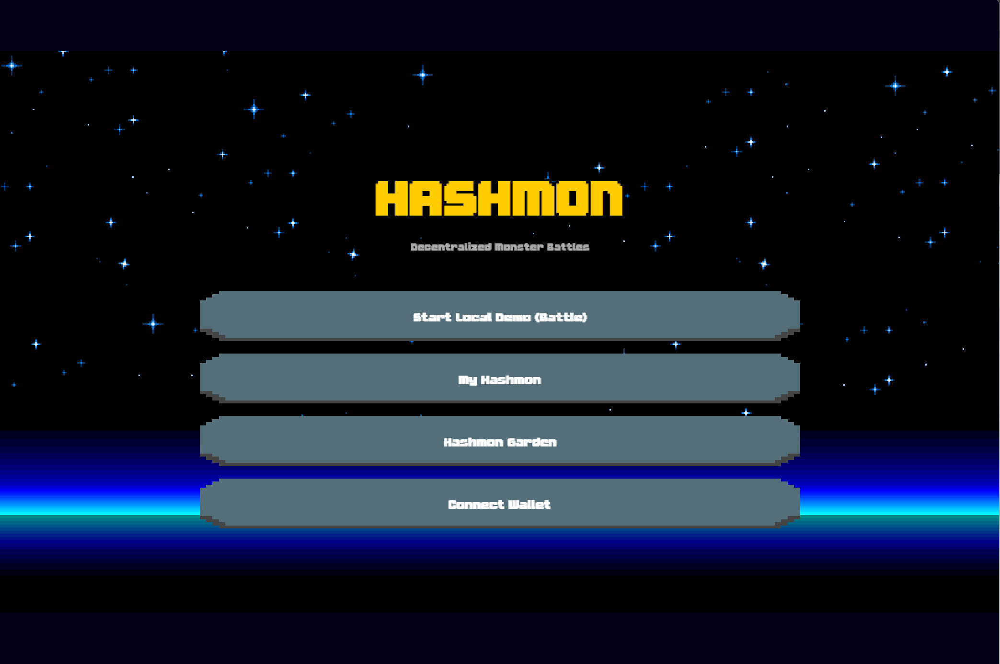
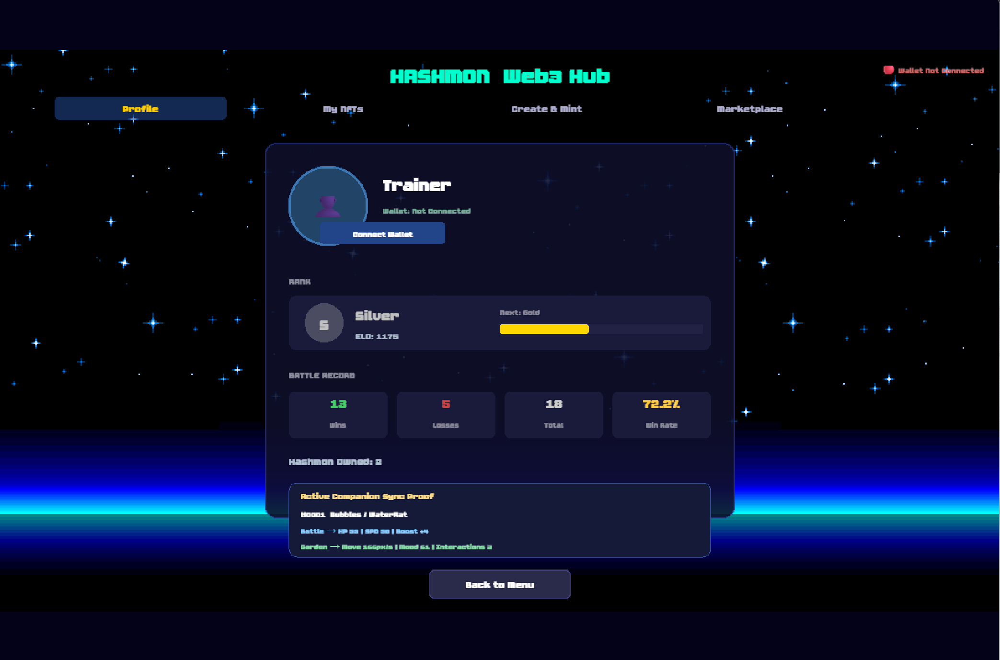
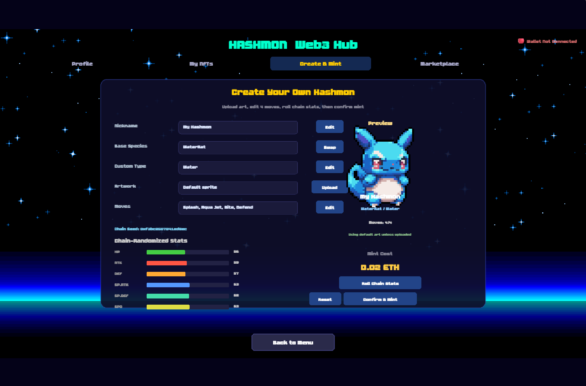
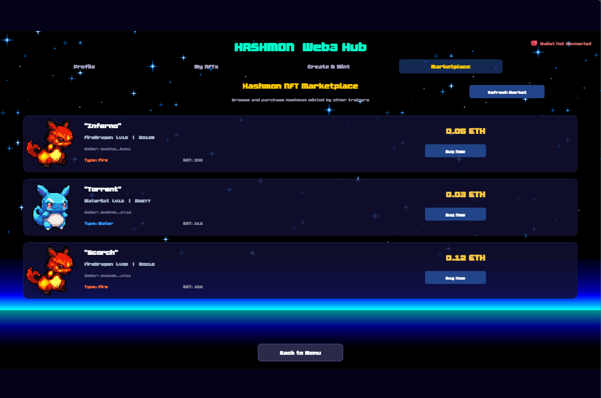
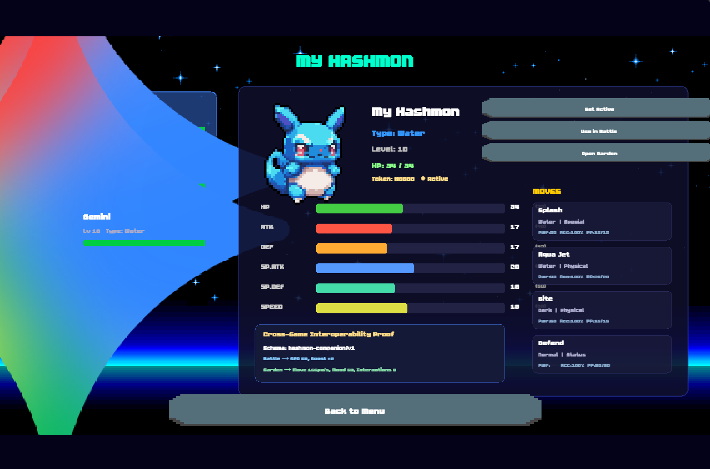
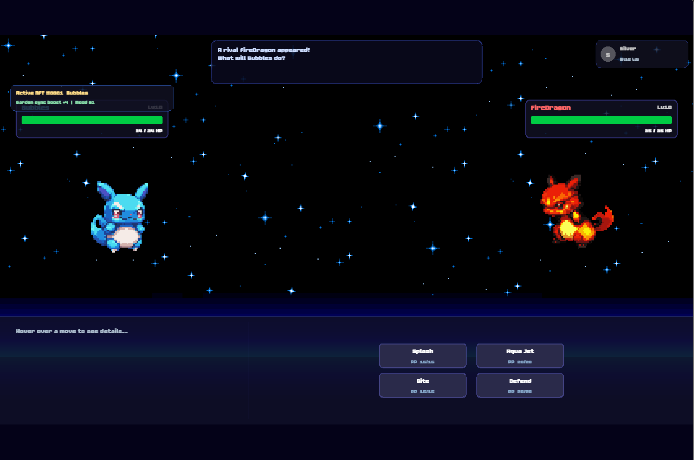

<h1 align="center">Hashmon</h1>

<p align="center">
  
</p>

<p align="center">
  <strong>A User-Generated, Cross-Game Digital Companion Ecosystem</strong><br/>
  A completed Web3 monster companion prototype with wallet connection, NFT minting, scene reuse, and marketplace interaction.
</p>

<p align="center">
  
  
  
  
  
</p>

---

## 项目简介

Hashmon 是一个已经完成核心闭环的 Web3 游戏课程项目原型。它基于 Phaser 3 构建，以“数字宠物 / 怪兽伙伴”为主题，将游戏玩法、NFT 所有权、IPFS 元数据存储、以及跨场景角色复用结合到同一个完整演示中。

在这个项目中，玩家可以：

- 连接 MetaMask 钱包
- 创建并自定义自己的 Hashmon
- 上传自定义图片和元数据到 IPFS
- 在 Sepolia 上 Mint NFT
- 在 My NFTs / Inventory 中查看链上角色
- 在 Battle 与 Garden 两种场景中复用同一只 NFT 伙伴
- 使用 Marketplace 合约进行上架与购买演示

这个项目最终希望回答一个问题：

> 如果玩家投入了时间和感情培养一只数字伙伴，那么它为什么必须被锁死在单一游戏中？

Hashmon 给出的答案是：通过 NFT 身份层、可移植元数据结构与轻量 Companion Protocol，可以在一个受控原型中验证“同一只链上角色在不同场景中持续复用”的可行性。

---

## 项目当前完成状态

### 已完成的完整能力

- 真实 MetaMask 钱包连接
- Sepolia 测试网 NFT Mint
- NFT 元数据与用户上传图片的 IPFS 存储
- 自定义 Nickname / Species / Type / Moves / Artwork
- My NFTs 与 Inventory 的链上读取与展示
- Marketplace 的 List / Buy 演示闭环
- Battle Scene 与 Garden Scene 的跨场景 NFT 复用
- Cross-Game Interoperability Proof 可视化展示
- 完整课程报告、截图资产与 Overleaf 论文材料

换句话说，这个仓库已经不是早期 demo，而是一个适合课程展示、答辩和后续扩展的“完成版原型”。

---

## 核心亮点

### 1. Web3 游戏完整闭环
从钱包连接、IPFS 上传、NFT 铸造，到链上资产读取与场景内使用，Hashmon 打通了完整的端到端流程。

### 2. 用户生成角色内容
玩家并不是只能使用预设角色，而是可以主动定义昵称、属性、技能组合以及图片资源，让每只 Hashmon 都具有个性化身份。

### 3. 跨场景互操作性证明
同一只 NFT 不仅能被展示，还能以“Active Companion”的形式进入 Battle 与 Garden 两种环境，并以不同语义解释同一组 portable attributes。

### 4. 课程项目展示友好
整个前端结构轻量、清晰、可直接本地运行，并配有报告、图表、截图与部署文档，方便答辩与演示。

---

## 功能模块总览

| 模块 | 完成情况 | 说明 |
| --- | --- | --- |
| Start Scene | 完成 | 主页与导航入口 |
| Web3 Hub | 完成 | 钱包连接、Mint、NFT 展示、Marketplace |
| Battle Scene | 完成 | 回合制对战与角色属性演示 |
| Garden Scene | 完成 | 轻互动养成 / 漫游展示 |
| Inventory Scene | 完成 | 查看角色属性、技能、自定义贴图 |
| HashmonNFT 合约 | 完成 | NFT 铸造、tokenURI 绑定 |
| Marketplace 合约 | 完成 | 上架、购买、取消交易 |
| IPFS 集成 | 完成 | 图片与 metadata 上传 |
| Companion Protocol | 完成 | 统一 portable companion 数据层 |

---

## 项目截图

### 游戏与 Web3 入口

<p align="center">
  
  
</p>

### Create & Mint

<p align="center">
  
</p>

### Marketplace

<p align="center">
  
</p>

### Cross-Game Interoperability Proof

<p align="center">
  
  
</p>

---

## 技术栈

| 分类 | 技术 |
| --- | --- |
| 游戏引擎 | Phaser 3 |
| 前端 | Vanilla JavaScript, ES Modules |
| Web3 交互 | Ethers.js v6 |
| 智能合约 | Solidity + Hardhat |
| 合约库 | OpenZeppelin Contracts |
| NFT 元数据 | IPFS / Pinata |
| 网络 | Sepolia |
| 报告产出 | Markdown + Overleaf LaTeX |

---

## 架构说明

Hashmon 的整体结构可以理解为 4 层：

1. **Gameplay Layer**
   - Start / Web3 / Inventory / Battle / Garden 等 Phaser 场景
2. **Companion Data Layer**
   - PlayerProfile 与 Companion Protocol，负责统一角色身份、属性和状态
3. **Blockchain Layer**
   - HashmonNFT 与 HashmonMarketplace 合约
4. **Storage Layer**
   - IPFS / Pinata 存储 metadata 与用户上传图片

这让项目既保留了游戏演示的直观性，也具备链上资产所有权和可扩展性的表达能力。

---

## 快速开始

### 1. 安装依赖

```bash
npm install
```

### 2. 启动本地静态服务器

由于项目使用原生模块，请不要直接双击 HTML 文件，需通过本地服务器访问。

#### 方式一：Python

```bash
python -m http.server 8080
```

#### 方式二：Node

```bash
npx http-server . -p 8080
```

然后访问：

```text
http://localhost:8080
```

### 3. 如需合约编译

```bash
npm run compile
```

### 4. 如需部署到 Sepolia

```bash
npm run deploy:sepolia
```

> 部署前请先配置好 .env 中的钱包私钥与 RPC。

---

## 演示流程建议

如果你希望向老师或面试官展示这个项目，可以按下面顺序操作：

1. 打开首页，展示 Phaser 游戏入口
2. 进入 Web3 Hub，连接 MetaMask
3. 切换到 Sepolia 网络
4. 打开 Create & Mint，自定义一只 Hashmon
5. 上传图片并 Mint NFT
6. 在 My NFTs / Inventory 中展示读取到的链上角色
7. 将其设为 Active Companion
8. 分别进入 Garden 与 Battle，展示同一只 NFT 的跨场景复用
9. 打开 Marketplace，展示上架 / 购买闭环

这是一条非常适合课程答辩的完整叙事链。

---

## Sepolia 合约地址

当前前端配置中的测试网地址如下：

- **HashmonNFT**: 0x3Af487e17274d73cB3Ed54DD01df3afCD6351C3E
- **HashmonMarketplace**: 0x61209CdF536740ab3cA939dC12580F1AF2B1d04D

如需修改，可查看：

- [src/data/ContractConfig.js](src/data/ContractConfig.js)

---

## 项目结构

```text
Hashmon/
├─ assets/                  # 游戏美术资源
├─ contracts/               # Solidity 合约
├─ scripts/                 # Hardhat 部署脚本
├─ FTE4312/                 # 报告、截图、论文与图表素材
├─ src/
│  ├─ battle/               # 战斗逻辑
│  ├─ data/                 # 角色、配置、协议、玩家资料
│  └─ scenes/               # 各个 Phaser 场景
├─ hardhat.config.js        # Hardhat 配置
├─ index.html               # 项目入口
├─ package.json             # 依赖与脚本
└─ README.md                # 项目说明
```

---

## 重要文档

- [WEB3_HANDOFF.md](WEB3_HANDOFF.md) — 项目交接与 Web3 集成记录
- [progress.md](progress.md) — 进展说明
- [SEPOLIA部署指南.md](SEPOLIA部署指南.md) — 合约部署说明
- [WEB3调试与IPFS指南.md](WEB3调试与IPFS指南.md) — 本地调试与 IPFS 使用说明
- [FTE4312/Hashmon_Final_Report.md](FTE4312/Hashmon_Final_Report.md) — 最终报告草稿
- [FTE4312/main.tex](FTE4312/main.tex) — Overleaf/LaTeX 论文版本

---

## 适用用途

这个仓库适合用于：

- Web3 游戏课程项目展示
- Phaser + NFT 集成示例
- 区块链前端与 IPFS 原型开发参考
- “跨游戏数字伙伴”概念验证
- 学术报告 / 毕业设计早期方向探索

---

## 已知限制

虽然项目核心功能已经完成，但它仍然是一个课程级原型，而不是生产级商业产品。当前仍存在以下限制：

- Marketplace UI 仍可进一步优化
- 部分输入流程仍较 demo-oriented
- ERC-6551 尚未完整落地
- IPFS 凭据管理在生产环境中应通过后端代理处理
- 目前的 interoperability proof 是受控环境中的验证，而不是跨公司通用标准

---

## 未来扩展方向

- 更丰富的 Hashmon 物种与技能系统
- 更完整的养成 / 装备 / 进化机制
- 排行榜与 ELO 后端 API
- 更成熟的链上成长设计
- Token Bound Account / ERC-6551 扩展
- 扩展到更多小游戏或 companion-based experiences

---

## Acknowledgement

This project was built for academic demonstration, rapid prototyping, and Web3 game design exploration.

If you find it useful, feel free to fork it and continue building on the idea of persistent on-chain digital companions.
