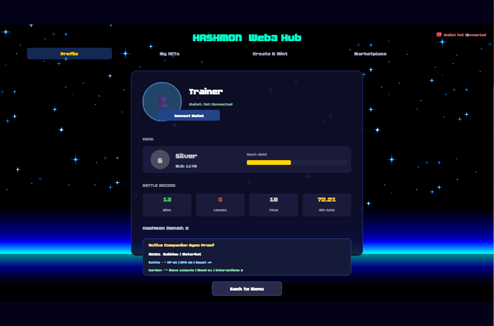
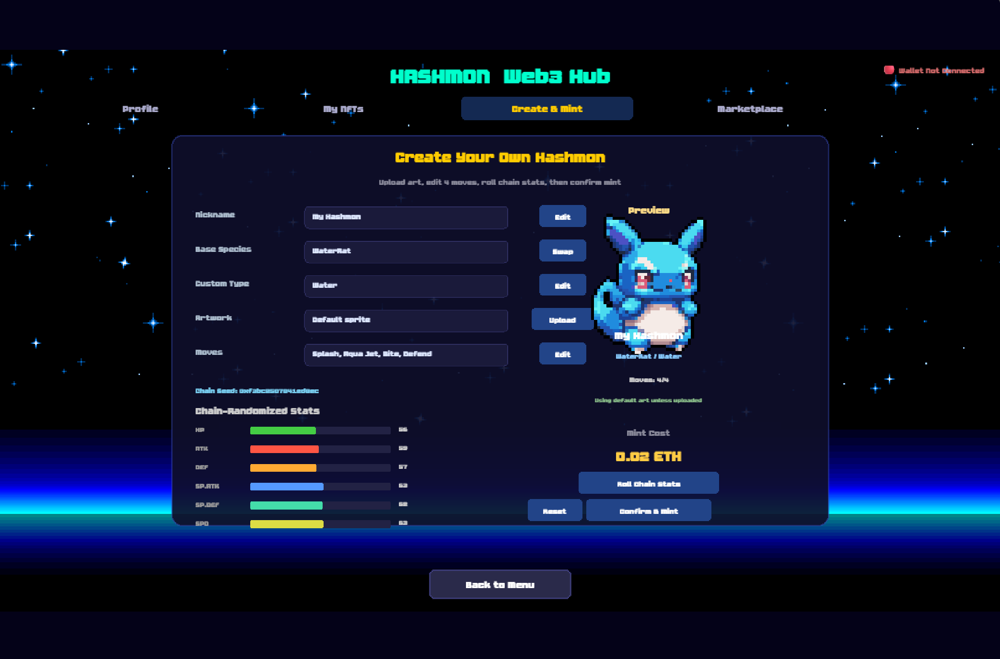

[English](README_en.md) | [中文](README.md)

<h1 align="center">Hashmon</h1>

<p align="center">
  
</p>

<p align="center">
  <strong>A User-Generated, Cross-Game Digital Companion Ecosystem</strong><br/>
  A completed Web3 monster companion prototype with wallet connection, NFT minting, scene reuse, and marketplace interaction.
</p>

<p align="center">
  
  
  
  
  
</p>

---

## Project Overview

Hashmon is a completed Web3 game course project prototype with a core closed-loop. Built on Phaser 3 with a "digital pet/monster companion" theme, it integrates gameplay, NFT ownership, IPFS metadata storage, and cross-scene character reuse into a single comprehensive demo.

In this project, players can:

- Connect a MetaMask wallet
- Create and customize their own Hashmon
- Upload custom images and metadata to IPFS
- Mint NFTs on the Sepolia testnet
- View on-chain characters in My NFTs / Inventory
- Reuse the same NFT companion across Battle and Garden scenes
- Interact with the Marketplace contract (list and buy)

This project aims to answer one fundamental question:

> If a player invests time and emotion into nurturing a digital companion, why should it be locked to a single game?

Hashmon's answer: By using an NFT identity layer, portable metadata structures, and a lightweight Companion Protocol, the feasibility of "reusing the same on-chain character across different scenes" can be verified in a controlled prototype.

---

## Current Completion Status

### Fully Implemented Features

- Real-world MetaMask wallet connection
- Sepolia testnet NFT minting
- IPFS storage for user-uploaded images and NFT metadata
- Customization of Nickname, Species, Type, Moves, and Artwork
- On-chain reading and rendering for My NFTs and Inventory
- Closed-loop Marketplace demonstration (List / Buy)
- Cross-scene NFT reuse (Battle Scene and Garden Scene)
- Visual demonstration of Cross-Game Interoperability Proof

---

## Core Highlights

### 1. Complete Web3 Gaming Loop
From wallet connection, IPFS upload, and NFT minting, to reading on-chain assets and using them in-game scenes—Hashmon completes the full end-to-end workflow.

### 2. User-Generated Character Content
Instead of being restricted to preset characters, players actively define nicknames, attributes, skill combinations, and image assets, giving every Hashmon a personalized identity.

### 3. Proof of Cross-Scene Interoperability
The identical NFT is not only displayed but also serves as an "Active Companion" entering two different environments (Battle and Garden), interpreting the same set of portable attributes with different semantics.

### 4. Course Project & Presentation Friendly
The entire frontend structure is lightweight, clearly organized, and can be run locally right out of the box.

---

## Feature Modules Overview

| Module | Status | Description |
| --- | --- | --- |
| Start Scene | Completed | Home page and navigation hub |
| Web3 Hub | Completed | Wallet connect, Mint, NFT gallery, Marketplace |
| Battle Scene | Completed | Turn-based combat & attribute demonstration |
| Garden Scene | Completed | Lightweight interaction/nurturing and roaming |
| Inventory Scene | Completed | View character stats, moves, custom artwork |
| HashmonNFT Contract | Completed | NFT minting, tokenURI binding |
| Marketplace Contract | Completed | Listing, purchasing, and canceling trades |
| IPFS Integration | Completed | Image and metadata upload |
| Companion Protocol | Completed | Unified mapping for portable companion data |

---

## Screenshots

### Game & Web3 Entry

<p align="center">
  
  
</p>

### Create & Mint

<p align="center">
  
</p>

### Marketplace

<p align="center">
  
</p>

### Cross-Game Interoperability Proof

<p align="center">
  
  
</p>

---

## Tech Stack

| Category | Technology |
| --- | --- |
| Game Engine | Phaser 3 |
| Frontend | Vanilla JavaScript, ES Modules |
| Web3 Interaction | Ethers.js v6 |
| Smart Contracts | Solidity + Hardhat |
| Contract Libs | OpenZeppelin Contracts |
| NFT Metadata | IPFS / Pinata |
| Network | Sepolia |
| Report & Docs | Markdown + Overleaf LaTeX |

---

## Architecture Overview

Hashmon's overall structure can be divided into 4 main layers:

1. **Gameplay Layer**
   - Phaser scenes: Start, Web3, Inventory, Battle, Garden, etc.
2. **Companion Data Layer**
   - PlayerProfile and Companion Protocol for unifying character identities, attributes, and states.
3. **Blockchain Layer**
   - HashmonNFT and HashmonMarketplace contracts.
4. **Storage Layer**
   - IPFS / Pinata for storing metadata and user-uploaded avatars.

---

## Quick Start

### 1. Install Dependencies

```bash
npm install
```

### 2. Start Local Static Server

Since the project uses native ES modules, avoid double-clicking the HTML files directly. Use a local server to access it.

#### Method 1: Python

```bash
python -m http.server 8080
```

#### Method 2: Node

```bash
npx http-server . -p 8080
```

Then visit:

```text
http://localhost:8080
```

### 3. Compile Contracts (Optional)

```bash
npm run compile
```

### 4. Deploy to Sepolia (Optional)

```bash
npm run deploy:sepolia
```

> Please configure your wallet private key and RPC in `.env` before deploying.

---

## Sepolia Contract Addresses

The default testnet addresses configured in the frontend:

- **HashmonNFT**: 0x3Af487e17274d73cB3Ed54DD01df3afCD6351C3E
- **HashmonMarketplace**: 0x61209CdF536740ab3cA939dC12580F1AF2B1d04D

To modify them, please check:

- [src/data/ContractConfig.js](src/data/ContractConfig.js)

---

## Project Structure

```text
Hashmon/
├─ assets/                  # Game art resources
├─ contracts/               # Solidity smart contracts
├─ scripts/                 # Hardhat deployment scripts
├─ FTE4312/                 # Reports, screenshots, paper & diagram assets
├─ src/
│  ├─ battle/               # Combat logic
│  ├─ data/                 # Characters, config, protocol, profile
│  └─ scenes/               # Phaser scenes
├─ hardhat.config.js        # Hardhat config
├─ index.html               # Project entry
├─ package.json             # Dependencies and scripts
└─ README.md                # Project README
```

---

## Important Documentation

- [WEB3_HANDOFF.md](WEB3_HANDOFF.md) — Project handoff and Web3 integration notes
- [progress.md](progress.md) — Progress report
- [SEPOLIA部署指南.md](SEPOLIA部署指南.md) — Contract deployment guide
- [WEB3调试与IPFS指南.md](WEB3调试与IPFS指南.md) — Local testing and IPFS usage guide
- [FTE4312/Hashmon_Final_Report.md](FTE4312/Hashmon_Final_Report.md) — Final report draft
- [FTE4312/main.tex](FTE4312/main.tex) — Overleaf/LaTeX academic paper template

---

## Use Cases

This repository is suitable for:

- Web3 game course project demonstrations
- Phaser + NFT integration examples
- Blockchain frontend & IPFS rapid prototyping
- "Cross-game digital companion" concept validations

---

## Known Limitations

Although the core functionality is complete, this remains a course-level prototype rather than a production-ready commercial product. Current limitations include:

- The Marketplace UI can be further polished.
- Certain input flows are still demo-oriented.
- ERC-6551 has not been fully implemented yet.
- IPFS credential management must be handled by a backend proxy in production environments.
- The current interoperability proof represents validation in a controlled environment, not a cross-company universal standard.

---

## Future Extensions

- Richer Hashmon species and skill systems
- Complete nurturing, equipment, and evolution mechanics
- Leaderboards and ELO backend APIs
- More mature on-chain growth economics
- Token Bound Account / ERC-6551 extensions
- Expansion into more mini-games or companion-based experiences

---

## Acknowledgement

This project was built for academic demonstration, rapid prototyping, and Web3 game design exploration.

If you find it useful, feel free to fork it and continue building on the idea of persistent on-chain digital companions.